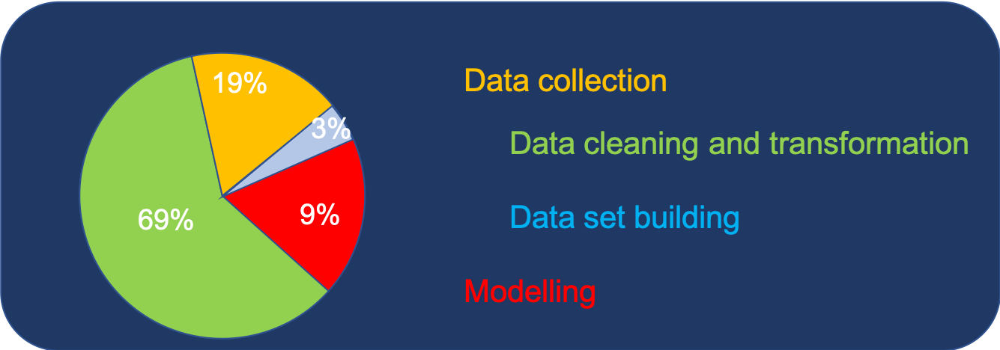

# Feature Engineering
## What is Feature engineering
Conceptually, feature engineering is a process that transforms data into features that can better represent business logic, thereby improving the performance of machine learning.

As shown in the figure above, it is an important step in data mining. In fact, it is also the most time-consuming and ignoring step According to <a href = https://whatsthebigdata.com/2016/05/01/data-scientists-spend-most-of-their-time-cleaning-data/> Data Scientists Spend Most of Their Time Cleaning Data </a>.

## Purpose of the Gibhub
This Github is mainly used to introduce some commonly used methods, as well as some feature engineering methods independently researched and developed by SDSC staff. 

## Transformations
All methods are summarized in the transformation.py file and displayed through test_transformation.ipy

# Future works
Through the introduction, we know that there are less than 100 conversions in total. However, attribute conversion is time-consuming, because the combination of the methods described above can generate new conversion methods